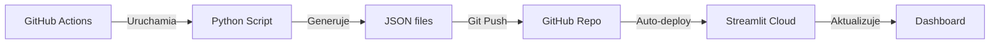

# 🤖 GitHub Actions - Automatyzacja

Ten folder zawiera skrypty automatyzacji dla Horyzont Partnerów.

## 📅 Harmonogram

| Workflow | Częstotliwość | Czas (UTC) | Co robi |
|----------|---------------|------------|---------|
| **Daily Snapshot** | Codziennie | 20:00 | Zapisuje snapshot portfela |
| **Monthly Audit** | 1. dnia miesiąca | 09:00 | Pełny audyt compliance |
| **AI Conversations** | 2x dziennie | 10:00, 18:00 | Autonomiczne dyskusje AI |
| **Knowledge Update** | Poniedziałek | 08:00 | Aktualizacja newsy rynkowe |

## 🔐 Wymagane Secrets

W GitHub → Settings → Secrets → Actions dodaj:

```
GOOGLE_API_KEY          (Gemini AI)
TRADING212_API_KEY      (Portfolio data)
OPENAI_API_KEY          (GPT - opcjonalne)
ANTHROPIC_API_KEY       (Claude - opcjonalne)
DEEPSEEK_API_KEY        (DeepSeek - opcjonalne)
GROQ_API_KEY            (Groq - opcjonalne)
HUGGINGFACE_API_KEY     (HF - opcjonalne)
OPENROUTER_API_KEY      (OpenRouter - opcjonalne)
```

## ▶️ Ręczne uruchomienie

Każdy workflow można uruchomić ręcznie:
1. Idź do **Actions** w GitHub
2. Wybierz workflow
3. Kliknij **Run workflow**

## 📊 Monitorowanie

- **Status**: GitHub Actions tab pokazuje wszystkie uruchomienia
- **Logi**: Kliknij na workflow → Zobacz szczegóły
- **Powiadomienia**: GitHub wyśle email jeśli coś się nie uda

## 💡 Limity (Free Plan)

- ✅ 2000 minut/miesiąc (wystarczy!)
- ✅ Nielimitowane publiczne repo
- ✅ 500MB storage artifacts

## 🔧 Debugowanie

Jeśli workflow failuje:
1. Sprawdź logi w Actions tab
2. Upewnij się że secrets są ustawione
3. Sprawdź czy pliki Python są poprawne
4. Uruchom lokalnie: `python daily_snapshot.py`

## 🚀 Deployment Flow



## 📝 Modyfikacja harmonogramu

Edytuj plik `.yml` i zmień cron expression:

```yaml
schedule:
  - cron: '0 20 * * *'  # Minuty Godziny Dzień Miesiąc Dzień_tygodnia
```

Przykłady:
- `0 */6 * * *` - Co 6 godzin
- `0 9 * * 1-5` - Dni robocze o 9:00
- `0 0 1 * *` - 1. każdego miesiąca

## 🎯 Status Badge

Dodaj do README.md:

```markdown

```
